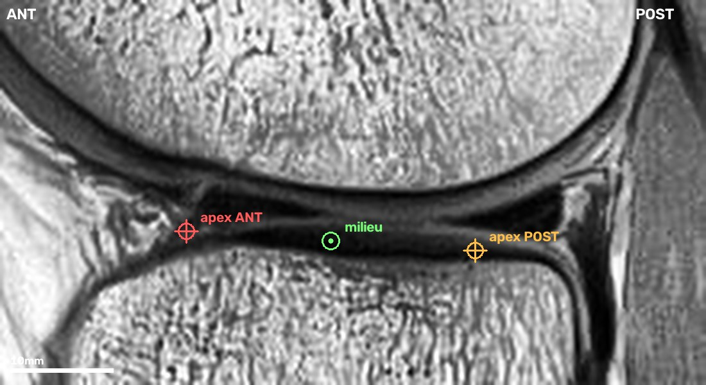

# `lat_centre` — what the point means

One point per study: the centre of the **lateral meniscus**, on one sagittal slice.

Read this once before the first click and keep it open. Two people who each annotate
sensibly but differently produce two datasets, not one, and nothing downstream can tell
them apart. The definition is worth more than the care taken on any individual study.

## Which end of the stack is lateral

The tool says so, per study, in the badge on the image — `LATERAL → high slice numbers`
or `LATERAL ← low slice numbers`. It is not the same end on a left and a right knee, and
the bundle shows the acquisition unmirrored, so the badge is the only thing to trust.

Where the badge comes from depends on the study. Blue means the DICOM `Laterality` tag —
the scanner's own record. Orange means it was inferred from where the knee sits in the
scanner, which is right about 91 % of the time. No badge means neither was available. On
anything but blue, find the fibular head yourself — see section 4.

## 1. The slice: where the two triangles are clearest

Scroll from the lateral edge inward. The meniscus first appears as a continuous dark
band across the joint line — the *bowtie*, the sagittal plane cutting the C-shaped body
lengthwise. Keep going and the band separates into **two dark triangles** facing each
other, the anterior and posterior horns, with a gap between them.

Take a slice from that second range, where both triangles are present and well formed.
If several qualify, take the middle one. Not the bowtie slices; not so far toward the
notch that the horns have thinned to slivers.

## 2. The point: midway between the two apexes, on the joint line

Each triangle has an apex — the pointed tip aimed at the centre of the joint. Put the
point **halfway between the two apexes**, vertically **on the joint line**: the dark
line between the femoral condyle above and the tibial plateau below.

It lands in the gap between the horns, on almost nothing. That is deliberate. The two
apexes are geometric features every knee has, and their midpoint does not move when one
horn is damaged.

## 3. Click even when the meniscus is abnormal — especially then

A torn, macerated, extruded or post-operative meniscus still gets a point, placed where
the geometry says it goes, not where the surviving tissue is. If the posterior horn is
gone, use where its apex would be — the tibial plateau and the femoral condyle are still
there to tell you.

This is the rule that matters most. The point must be defined by anatomy that is present
whether or not the pathology is. If the point drifts toward the damage on positives, the
ROI predicted from it drifts too, and the crop starts encoding the label through its own
position — a signal that exists in the training set and nowhere else.

## 4. When there is no badge, or the badge is a guess

The first bundle held only studies carrying the DICOM `Laterality` tag. That filter turned
out to select a manufacturer — the tag is written by whole vendors — so later bundles admit
untagged studies, and on those the badge is either absent or **inferred from where the knee
sits in the scanner**, a rule that is right about 91 % of the time. An inferred badge is
drawn in orange and says so. Do not lean on it.

Orient yourself instead on the **fibular head**: a second bone, detached from the tibia,
low and posterior, which exists only on the lateral side. Scroll to one end of the stack,
then the other; it appears at one and never at the other.

Then click, and **enter nothing else**. The lateral meniscus sits about 25 mm from the
lateral edge of a knee roughly 80 mm wide, so your point lands distinctly nearer one end —
and that end is the lateral one. Measured on the first 161 annotations: it agrees with the
tag **161 times out of 161**, and the most central click was still 31 % of the half-stack
from the middle. Saying which side you are on would only restate the click.

Where a tag does exist, the two answers are compared, and a disagreement is reported — a
point on the wrong compartment is the one error this dataset cannot survive, and nothing
else would catch it.

## When to skip (`S`)

- You cannot find the fibular head, so you cannot tell the compartments apart.
- The banner says the slice geometry was unusable and file order was kept. The slices
  may not be in anatomical order, so "which end is lateral" means nothing.
- You cannot find the joint line at all — motion, artefact, an implant flooding the
  image.

Skipping is cheap and honest. The model does not need every study; it needs the ones it
gets to be right.

## If you are unsure

**Consistency beats correctness.** Pick a reading and hold it across the whole set. A systematic
3 mm offset costs nothing — the ROI is 40 mm wide and absorbs it. An offset that varies
from study to study is noise the model has to average away, and it never fully does.

When two readings of this document are both defensible, that is a defect in the
document. Write it down and we fix the text, not the clicks.
